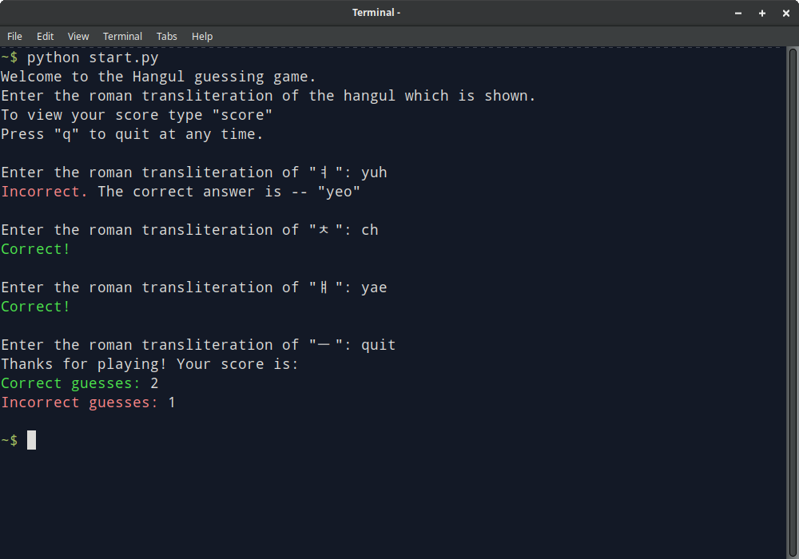

# Hangul guessing game

This CLI app helps you master the fundamentals of Hangul by training you to recognize all consonants and vowels.


## Dependencies

- Python 3.7+


## Running

Execute the following in your CLI:

```
python start.py
```

## Game preview


